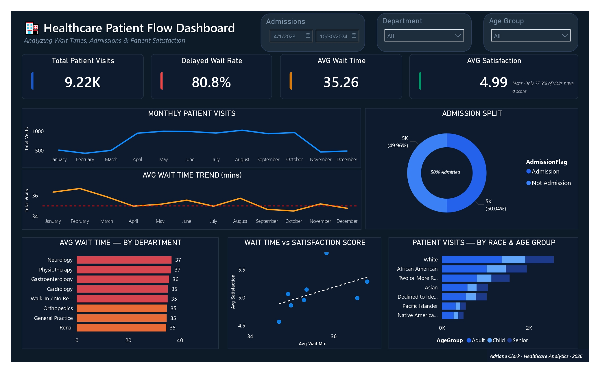

# 🏥 Healthcare Analytics — Patient Flow Dashboard

> **End-to-end data analytics project** covering data cleaning in Excel, SQL analysis in MySQL, and an interactive Power BI dashboard — built on a real-world hospital patient flow dataset.

---

## Dashboard Preview



---

## 📋 Table of Contents

- [Project Overview](#project-overview)
- [Dataset Summary](#dataset-summary)
- [Tools & Technologies](#tools--technologies)
- [Project Structure](#project-structure)
- [Data Cleaning (Excel)](#data-cleaning-excel)
- [SQL Analysis (MySQL)](#sql-analysis-mysql)
- [Power BI Dashboard](#power-bi-dashboard)
- [Key Insights](#key-insights)
- [Recommendations](#recommendations)
- [How to Reproduce](#how-to-reproduce)
- [Author](#author)

---

## Project Overview

This project analyzes **9,216 patient visits** at a hospital across **April 2023 – October 2024**. The goal is to identify operational bottlenecks, patient satisfaction drivers, and demographic patterns to support hospital administrators in making data-driven decisions.

**Business Questions Answered:**
1. What percentage of patients experience delayed wait times, and which departments are worst?
2. How does wait time correlate with patient satisfaction scores?
3. Are there demographic disparities in admission rates or wait times?
4. What are the monthly volume trends and peak admission periods?

---

## Dataset Summary

| Attribute | Value |
|---|---|
| Total Records | 9,216 |
| Date Range | April 2023 – October 2024 |
| Departments | 7 referred + Walk-In |
| Patient Age Range | 1 – 79 years |
| Satisfaction Score Range | 0 – 10 |
| Wait Time Range | 10 – 60 minutes |

**Columns (after cleaning):**

| Column | Description |
|---|---|
| `PatientID` | Unique patient identifier (SSN-format) |
| `AdmissionDate` | Date of visit (YYYY-MM-DD) |
| `AdmissionTime` | Time of visit |
| `Gender` | Patient gender |
| `Age` / `AgeGroup` | Numeric age + Child/Adult/Senior group |
| `Race` | Patient race/ethnicity |
| `DeptReferral` | Referring department or Walk-In |
| `AdmissionFlag` | Admission vs Not Admission |
| `SatisfactionScore` | 0–10 score (27.3% fill rate) |
| `WaitTimeMin` | Wait time in minutes |
| `WaitCategory` | Fast (≤30 min) or Delayed (>30 min) |
| `Month` | YYYY-MM for time series |
| `DayOfWeek` | Day name |

---

## Tools & Technologies

| Tool | Purpose |
|---|---|
| **Excel (openpyxl)** | Data cleaning, issue log, pivot tables |
| **MySQL 8+** | Exploratory queries, window functions, views |
| **Power BI Desktop** | Interactive dashboard & presentation |
| **Python (pandas)** | Data preparation pipeline |
| **GitHub** | Version control & portfolio |

---

## Project Structure

```
healthcare-patient-flow/
│
├── data/
│   └── healthcare_analytics_patient_flow_data1.csv    # Raw data
│
├── excel/
│   └── Healthcare_Patient_Flow_Cleaned.xlsx           # Cleaned workbook
│       ├── Cleaned Data          (main cleaned table)
│       ├── Data Issues Log       (cleaning decisions documented)
│       ├── Summary Statistics    (key KPIs)
│       ├── Pivot - Dept Wait Time
│       ├── Pivot - Demographics
│       └── Pivot - Monthly Trend
│
├── sql/
│   └── healthcare_mysql_queries.sql                   # All SQL queries
│       ├── Section A: Overview & Volume
│       ├── Section B: Wait Time Analysis
│       ├── Section C: Patient Satisfaction
│       ├── Section D: Demographic Analysis
│       ├── Section E: Advanced Window Functions
│       └── Section F: Views for Power BI
│
├── powerbi/
│   └── Healthcare_Patient_Flow.pbix                   # Power BI dashboard
│
├── report/
│   └── Healthcare_Analytics_Project_Report.md         # Full project report
│
└── README.md
```

---

## Data Cleaning (Excel)

Raw data had several issues that were identified, documented, and resolved:

| # | Issue | Action |
|---|---|---|
| 1 | Mixed date formats (`YYYY-MM-DD` and `DD/MM/YYYY`) | Standardised to `YYYY-MM-DD` |
| 2 | Gender typo: `"Femaleemale"` | Corrected to `"Female"` |
| 3 | 5,400 NULLs in `Department Referral` (58.6%) | Filled with `"Walk-In / No Referral"` |
| 4 | 6,699 NULLs in `Satisfaction Score` (72.7%) | Retained as NULL (unrated visits) |
| 5 | 4 exact duplicate columns (lowercase versions) | Removed duplicates |
| 6 | Redundant `Admission Date` column | Removed |
| 7 | `Unnamed: 20` residual column | Removed |
| 8 | `Admission Status` = "Not Admitted" for all 9,216 rows | Retained, flagged as low-utility |

**Deliverables:**
- `Cleaned Data` sheet with formatted table, auto-filters, freeze panes
- `Data Issues Log` — full audit trail of changes
- `Summary Statistics` — snapshot KPIs
- 3 pivot summary sheets for quick reference

---

## SQL Analysis (MySQL)

Six sections of queries covering:

**A — Overview & Volume**
- Total visits, admission rate, avg wait, avg satisfaction
- Monthly volume with MoM change using `LAG()`
- Day-of-week distribution

**B — Wait Time Analysis**
- Distribution by wait category (Fast / Delayed)
- Average wait by department
- Wait time by age group and gender
- Monthly trend

**C — Patient Satisfaction**
- Score distribution
- Avg satisfaction by department
- Satisfaction vs wait time buckets (does longer wait = lower scores?)
- Satisfaction by age group

**D — Demographic Analysis**
- Visits and admission rates by race
- Gender split
- Age group breakdown

**E — Advanced Queries (Window Functions)**
- `RANK()` — departments ranked by wait time
- Running total of monthly admissions with `SUM() OVER`
- CTE to flag patients waiting above department average
- `NTILE(4)` satisfaction percentiles by race
- Department share of total delayed visits

**F — Views for Power BI**
- `vw_monthly_kpi` — monthly KPI feed
- `vw_dept_performance` — department scorecard
- `vw_demographic_summary` — demographic breakdown

---

## Power BI Dashboard

**Recommended Pages:**

### Page 1 — Executive Summary
- KPI cards: Total Visits, Avg Wait, Avg Satisfaction, Admission Rate
- Line chart: Monthly visit volume (Apr 2023 – Oct 2024)
- Donut: Admission Flag split
- Bar: Top 5 departments by visit count

### Page 2 — Wait Time Deep Dive
- Gauge: Average wait time vs 30-min target
- Bar: Avg wait by department (with % delayed labels)
- Clustered bar: Wait by age group + gender
- Stacked bar: Fast vs Delayed by department

### Page 3 — Patient Satisfaction
- KPI: Avg satisfaction with conditional formatting
- Scatter: Wait time vs satisfaction score
- Bar: Avg satisfaction by department
- Matrix: Satisfaction by race × age group

### Page 4 — Demographics
- Map or treemap: Visit volume by race
- Stacked bar: Admission rate by race
- Pie: Gender distribution
- Clustered bar: Age group breakdown

**Slicers (apply to all pages):**
`AdmissionDate` (date range) | `Gender` | `AgeGroup` | `Race` | `DeptReferral`

---

## Key Insights

1. **80.8% of patients experience delayed wait times** (>30 min), making this the most critical operational issue.
2. **Neurology has the longest average wait** at ~36.8 min, followed by Physiotherapy (~36.6 min).
3. **Satisfaction scores are only recorded for 27.3% of visits** — a significant data quality gap limiting analysis.
4. **Senior patients report the lowest satisfaction** (avg 4.77 vs 5.09 for adults).
5. **Admission rates are consistent across races** (~49–51%) — no strong evidence of demographic disparity in admission decisions.
6. **Volume is consistent across all 19 months** (~430–530 visits/month) — no strong seasonal surge identified.
7. **Walk-in patients make up 58.6% of all visits**, suggesting the hospital relies heavily on self-referred traffic.

---

## Recommendations

1. **Target the 80.8% delayed rate** — implement a triage fast-track for low-acuity walk-in patients to bring the Fast % above 50%.
2. **Prioritise Neurology and Physiotherapy staffing** — these departments have the worst wait times and should be audited for resource allocation.
3. **Improve satisfaction survey completion** — with only 27.3% of visits rated, data is too sparse for reliable department-level benchmarking. Set a target of ≥70%.
4. **Invest in Senior patient experience** — seniors report the lowest satisfaction (4.77/10). Consider dedicated waiting areas, clearer communication, and mobility assistance.
5. **Analyse peak days** — combine this dataset with staffing records to ensure adequate coverage on the busiest days of the week.
6. **Monitor Walk-In volume** — nearly 3 in 5 patients arrive without a referral. A pre-registration system or online appointment booking could reduce walk-in congestion.

---

## How to Reproduce

### 1. Excel Cleaning
Open `Healthcare_Patient_Flow_Cleaned.xlsx` — all cleaning steps are documented in the `Data Issues Log` sheet.

### 2. MySQL Setup
```sql
-- Run the full script:
SOURCE sql/healthcare_mysql_queries.sql;
```
Import `Cleaned Data` sheet (export as CSV first) using MySQL Workbench's Table Data Import Wizard.

### 3. Power BI
- Connect to MySQL using the `vw_monthly_kpi`, `vw_dept_performance`, and `vw_demographic_summary` views
- Or connect directly to the cleaned Excel file
- Build visuals per the dashboard layout above

---

## Author

Adriane Clark Ballesteros  
Healthcare Data Analyst Trainee

* 🔗 GitHub: https://github.com/acbshields12

---

*Project built as part of a healthcare analytics portfolio. Dataset is sourced from Kaggle.com.*
